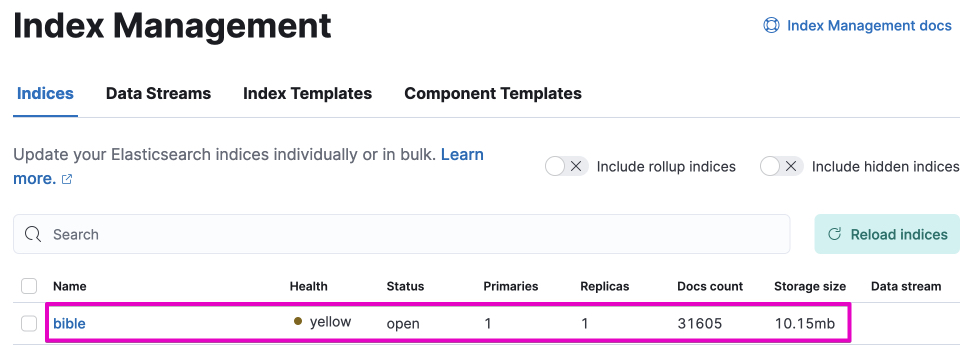
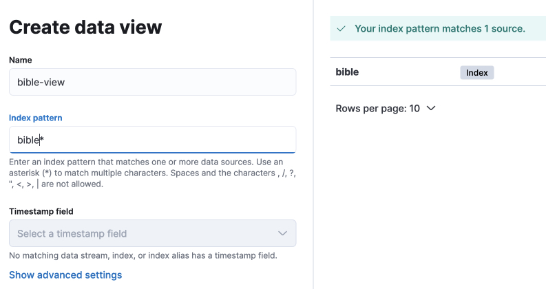
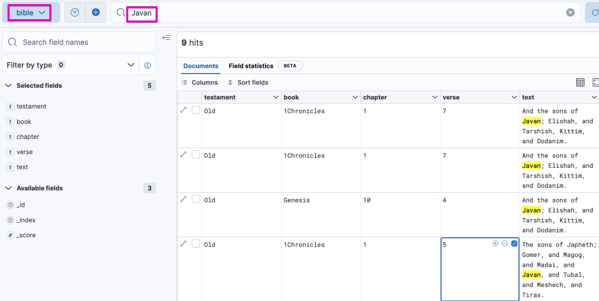

# Python3 Elasticsearch 8 Example

This is a small example of loading CSV files into Elasticsearch used as a test for work.

The input is CSV versions of text from the Bible that I lifted from [acrawford73](https://github.com/acrawford73/elasticsearch-bible-kjv). I needed something to index and being out of copyright the Bible fits the bill.

## Docker
A `docker-compose.yml` file is included that should bring up Elasticsearch and Kibana version 8.

## Python
- Install the python Elasticsearch library with pip:
```
pip install elasticsearch
```
- Amend the address to your Elasticsearch instance in the `config.ini` file
- Run the `main.py` script:
```
python3 main.py
```

## Kibana
Visit the Kibana web interface and check the Index Management for the number of documents in your index.

Then create a Data View with an index pattern pointing to your index e.g. `bible*`

Then use the Discover menu item to search for words in the index:

